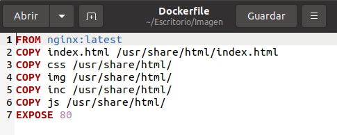
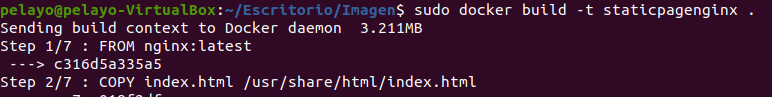
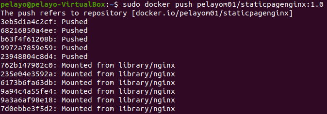
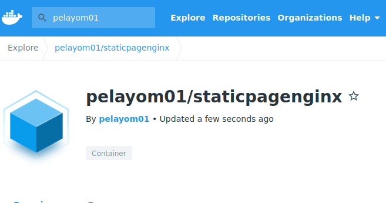
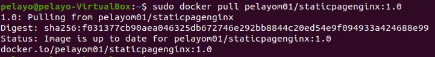

### Ejercicio Imagen

> tarea realizada por Gustavo y Pelayo



```bash
sudo docker bluid -t staticpagenginx . 
```




```bash
sudo docker push pelayom01/staticpagenginx:1.0	
```







```bash
sudo docker push pelayom01/staticpagenginx:1.0	
```




