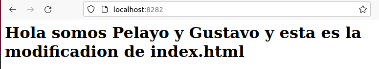

# Trabajo Almacenamiento

> Tarea realizada por Pelayo y Gustavo


### Pantallazos de arrancar los contenedores c1 y c2

```bash
docker run -d --name c1 -v /home/pelayo/Escritorio/saludo:/var/www/html -p 8181:80 php:7.4-apache
docker run -d --name c2 -v /home/pelayo/Escritorio/saludo:/var/www/html -p 8282:80 php:7.4-apache
```


### Pantallazos accediendo a c1 y c2 por sus puertosa correspondientes


### Pantallazos de los ficheros index modificados




