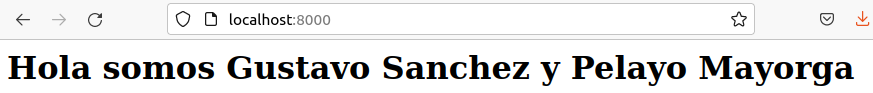
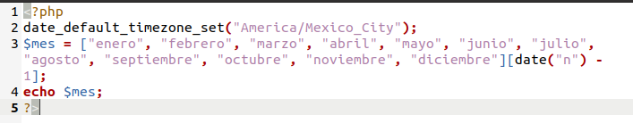
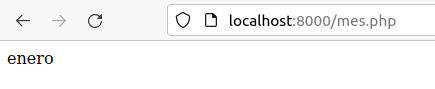
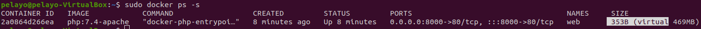
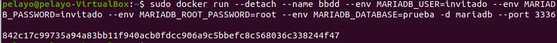
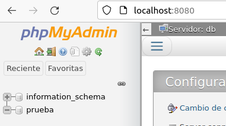
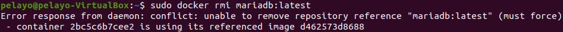

# Trabajo con imágenes

> Tarea realizada por Pelayo Mayorga y Gustavo Sanchez.


### Pantallazo del navegador de Index.html





### Pantallazo de la salida del script mes.php






### Pantallazo de el tamaño del contenedor web

```bash
sudo docker ps -s	
```




### Pantallazo mariadb bbdd






### Pantallazo de la imposibilidad de borrado

```bash
sudo docker rmi mariadb:latest
```




